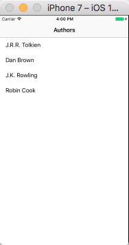

# NavigationControllerDemo
iOS From Scratch With Swift: Navigation Controllers and View Controller Hierarchies 
教程：[https://code.tutsplus.com/tutorials/ios-from-scratch-with-swift-navigation-controllers-and-view-controller-hierarchies--cms-25462](https://code.tutsplus.com/tutorials/ios-from-scratch-with-swift-navigation-controllers-and-view-controller-hierarchies--cms-25462)  
按照教程实现的demo，XCode 8.3.2； swift 3.1  
结果图片：  

